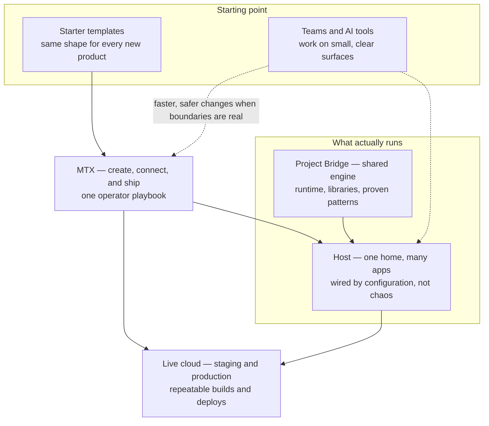

# Meanwhile-Together platform — executive brief

**Audience:** investors, clients, and executives who are not day-to-day software engineers.

**Related:** [holostic.md](holostic.md) (full technical map) · [holostic-developer.md](holostic-developer.md) (platform contributors) · [holostic-client.md](holostic-client.md) (org owners briefing themselves or an AI in plain language).

---

## What this is (in plain language)

Meanwhile-Together is a **software operating system for building and running many digital products from one disciplined foundation**.

- **Project Bridge** is the **shared product engine**: one modern server architecture, reusable building blocks, and a clear way to plug applications in without reinventing infrastructure each time.
- **MTX** is the **operator layer**: it **creates** new product repositories the right way, **wires** them into a host, and **ships** them through a repeatable cloud deploy path (the same steps your team or automation would run in staging and production).

You can think of it as **“factory + assembly line + standardized chassis.”** New customer-facing apps are not one-off science projects; they are **assembled products** that inherit stability, security posture, and deploy hygiene from the platform.

---

## Platform at a glance

How the pieces fit when you zoom **out** (left to right is **create → assemble → run**):

**Read it like this:** templates and MTX get you to a **properly shaped host**; Project Bridge is the **engine inside** that host; MTX is also the **delivery lane** to **live** environments—so “what we build” and “how we ship it” stay aligned.

---

## What problem it solves

### Fragmentation and “forever unique” software

Without a platform, every new initiative tends to get its **own** server, its **own** copy-pasted DevOps, its **own** drift between staging and production, and its **own** pile of one-off fixes. That is expensive, slow, and error-prone.

Meanwhile-Together **concentrates** the hard parts—hosting shape, build and bundle steps, infrastructure patterns—so product work stays **product-shaped**: user experience, domain logic, and go-to-market.

### The “everything file” and unmaintainable sprawl

When systems grow without boundaries, teams end up with **god files** and tangled dependencies: one change breaks three unrelated areas, and nobody dares refactor.

This stack **separates concerns by design**:

- A **host** runs multiple applications through **configuration**, not by cramming unrelated code into one monolith.
- Individual **product repos** stay **focused**; the **framework** carries shared behavior so you do not duplicate the same infrastructure logic in every repo.

That structure is not just cleaner for humans—it is **much easier for AI assistants to work safely**, because each change has a **smaller, clearer surface**.

### Context overload, token waste, and “coding in circles”

Modern AI coding tools are powerful, but they fail badly when the model must **hold an entire undocumented universe** in context: huge files, unclear ownership, missing tests, and no deploy truth.

A platform like this **shrinks the problem**:

- **Less context required** to make a correct change, because boundaries and conventions are real—not tribal knowledge.
- **Fewer round trips** spent rediscovering “how we deploy here” or “where the server starts,” because those paths are **standardized**.
- **Less thrash** (the same bug fixed three different ways in three places), because shared logic lives **once** in the framework layer.

This does not magically eliminate tokens; it **removes the work that should never have been model work in the first place**.

### “Vibe coding” without engineering discipline

Fast experimentation is valuable. **Shipping** fast experimentation without guardrails produces **fragile** software: it works on one laptop, fails in the cloud, and nobody knows why.

MTX-backed flows push teams toward **repeatable outcomes**: the same scaffold, the same build contract, the same deploy entry point—so creativity shows up in **the product**, not in **snowflake infrastructure**.

### Testing, validation, and “did we actually ship the right thing?”

No platform replaces human judgment on product quality. What this stack **does** provide is a **forcing function**: when deploy and build are **consistent**, you get a **clear binary signal**—either the pipeline’s definition of “good to ship” passed, or it did not.

That is the practical foundation for **earlier validation**: automated gates catch whole classes of integration mistakes **before** users do, and teams spend review time on **meaningful** risk—not on rediscovering MIME types, path prefixes, or “which folder is actually served.”

---

## How AI fits (without hype)

AI is treated as an **accelerator on top of a system that already knows how to behave**.

- **Faster iteration:** assistants edit **smaller, well-scoped** product surfaces instead of re-deriving an entire hosting model each time.
- **More stable output:** shared framework code and host contracts reduce “creative” deviations that compile locally but fail in production.
- **Better reuse:** one codebase philosophy (**DRY at the platform layer**) means fewer duplicated bugs and fewer incompatible copies of “the same idea.”

The goal is not “AI writes everything.” The goal is **AI writes the right things**, in **the right places**, with **less collateral damage**.

### Why “anyone can build” is not the same as “anyone can finish”

Almost anyone can produce *something* today—tools and AI make the first draft easy, the way a child can cover a page with marks for a long time. A toddler’s scribbles can even feel surprisingly expressive. But **motion is not craft**. Without rules, margins, and repetition, you do not get a **single cohesive picture**—you get noise. You do not get a **repeatable style** or a **deliberate shape** you can return to; you get endless variation with no memory. The missing ingredient is the boring adult stuff: **discipline**, **boundaries**, and the **wisdom earned from mistakes**—so the next pass improves the whole, instead of inventing a new universe on every page.

Software without structure fails the same way: lots of “doodling,” nothing that reliably fits together tomorrow. Meanwhile-Together is the **craft layer under the creativity**—shared rails so energy turns into something **coherent, shippable, and maintainable**, not an infinite sketchbook.

---

## Portability, maintenance, and total cost of ownership

- **One technical spine, many products:** multiple customer experiences can run on a **single operational model**, which lowers training cost, security review surface, and on-call surprise.
- **Portable patterns:** infrastructure and server patterns are **versioned and vendored** into hosts in a controlled way—teams upgrade deliberately instead of drifting silently.
- **Less clutter:** product repositories stay lean; heavy lifting lives where it belongs—in the **framework** and **operator tooling**—so you do not carry ten copies of the same glue code.

---

## What you should expect if you adopt or invest

**You are buying:**

- A **repeatable factory** for new applications and hosts.
- A **shared runtime architecture** that reduces duplicate engineering.
- A **deploy story** designed to be the same in CI and in an operator’s terminal—so “works on my machine” stops being a competitive disadvantage.

**You should still plan for:**

- Human ownership of **product intent**, **UX quality**, and **domain correctness**.
- Deliberate **governance** (who approves production deploys, how secrets are handled, how customer data is protected)—the platform makes good practice **easier**; it does not remove accountability.

---

## One-sentence pitch options

- **For investors:** “We industrialize how AI-era software is created and operated—so teams ship faster with fewer production surprises and lower long-term maintenance drag.”

- **For clients:** “You get a standardized way to launch and run products: less custom DevOps, clearer boundaries between apps, and a path to scale without your codebase turning into a landfill.”

- **For small businesses:** “You get the same ‘big company’ backbone—how apps are born, wired, and shipped—without hiring a full platform team, so you stay focused on customers instead of reinventing hosting every quarter.”

- **For friends and family (non-technical):** “It’s the difference between endlessly doodling and actually finishing a picture: shared rules and a repeatable path to the cloud, so a good idea doesn’t fall apart the moment it leaves someone’s laptop.”

---

## Where to go next (on purpose, lightly technical)

- **How creation and deploy work:** [MTX_CREATE_AND_DEPLOYMENT_FLOW.md](MTX_CREATE_AND_DEPLOYMENT_FLOW.md)  
- **Infra and deploy reference:** [INFRA_AND_DEPLOY_REFERENCE.md](INFRA_AND_DEPLOY_REFERENCE.md)  
- **Curated facts and sharp edges:** [rule-of-law.md](rule-of-law.md)  
- **Full stack mental model:** [holostic.md](holostic.md)
