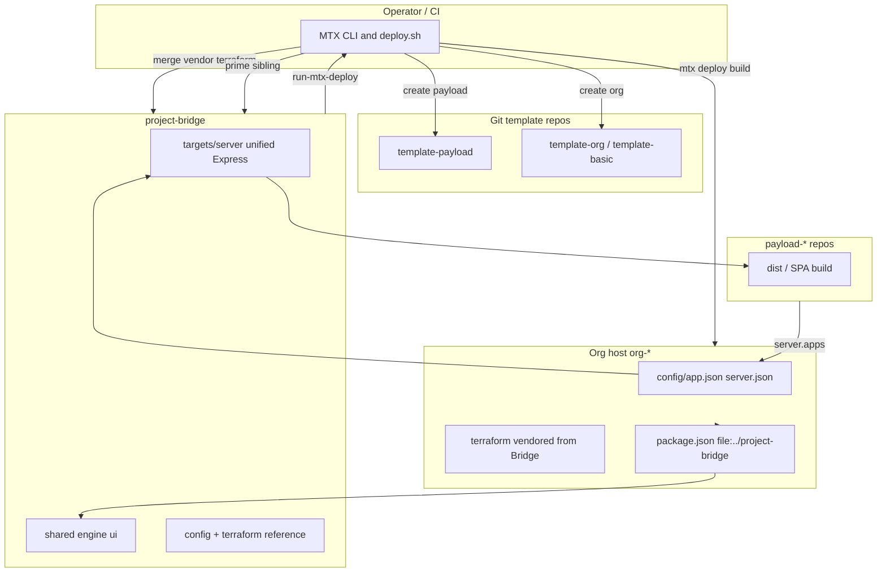

# Holistic view: Project Bridge, MTX, templates, and deployment

**Audience:** builders and operators who need one end-to-end mental model.

**Related (same family, not replacements):**

- [holostic-executive-brief.md](holostic-executive-brief.md) — investors / execs; includes *Platform at a glance* diagram.
- [holostic-developer.md](holostic-developer.md) — contributors to Bridge, MTX, templates, org wiring (one layer deeper than this page on *where to work* and *contracts*).
- [holostic-client.md](holostic-client.md) — org owners; plain language + how to brief an AI without fighting the framework.

---

## What Project Bridge is

**Project Bridge** is the **Meanwhile-Together framework monorepo**: npm workspaces built around a **unified Express server** (`targets/server`), shared packages (`shared`, `engine`, `ui`), demo/shell targets (web, desktop, mobile), and **reference** `config/`, `terraform/`, and Railway metadata. It is **not** the small “CLI that creates repos”; that role belongs to **MTX**. Bridge is the **runtime + libraries + canonical infra examples** that org hosts and payloads depend on.

In one sentence: **MTX operates the factory and the deploy pipeline; Project Bridge is the engine and the chassis everything bolts onto.**

---

## The layers (who owns what)

| Layer | Role |
|--------|------|
| **MTX** | Operator CLI: `mtx create org|payload|template`, workspace layout, **`deploy.sh`** → Terraform under **`$PROJECT_ROOT/terraform`**, **`mtx build server`**, **`railway up`**, vendoring payloads from `server.json`, priming sibling **`project-bridge`** during builds. |
| **Project Bridge** | Framework: unified server, payload resolution, addons (e.g. master backend), Prisma surfaces, docs, **`run-mtx-deploy.sh`** → **`$MTX_ROOT/deploy.sh`**. No `mtx create` implementation inside Bridge. |
| **Org host repos (`org-*`)** | **Normative deploy root**: tree with **`config/app.json`**, merged **`server.json`**, `prepare:railway`, `railway.json`, scripts that call into MTX + vendored Bridge packages via **`file:../project-bridge/...`**. |
| **Payload repos (`payload-*`)** | Optional siblings: SPA (and related) built to **`dist/`**, registered on the host via **`server.apps`** (`path`, `package`, or `git`). |
| **Git templates (`template-payload`, `template-org`, legacy `template-basic`)** | **Source repos** MTX clones when scaffolding; not “the framework” itself. |

So “the system” in practice is **MTX + Project Bridge + an org host + zero or many payloads**, with templates as **starting git trees** and Bridge as the **shared implementation**.

---

## How MTX and Bridge contract with each other

- **Sibling (or env) resolution**: MTX expects **`../project-bridge`**, **`vendor/project-bridge`**, or **`PROJECT_BRIDGE_ROOT`** for priming installs and **`npm run db:generate`** during org server builds.
- **Scaffolding**: On **`mtx create org`**, if the org template lacks pieces of **`config/`**, MTX can copy defaults from **`project-bridge/config/`**; it can **vendor `project-bridge/terraform`** into the new org repo; it **merges `package.json`** to depend on **`@meanwhile-together/shared`**, **`ui`**, dev **`engine`** via **`file:../project-bridge/...`** and wires scripts like **`prepare:railway`** / **`build:server`** toward the unified server layout.
- **Deploy**: From the org (or migration) tree, **`mtx deploy`** runs MTX’s **`deploy.sh`** and Terraform apply under **`$PROJECT_ROOT/terraform`**—that tree often **came from** Bridge but is **owned by the host repo** after vendoring.
- **From Bridge’s side**: **`npm run deploy:staging|production`** delegates to **`scripts/run-mtx-deploy.sh`**, which **`exec`s `bash "$MTX_ROOT/deploy.sh"`** (default sibling **`../MTX`**). So deploy **always funnels through MTX** when using those scripts.

Net: **MTX is the single deploy contract**; Bridge **re-exports** that contract for convenience and documents CI parity (for example GitHub Actions calling the same path).

---

## Templates: two different meanings

1. **MTX git templates** (`MTX_PAYLOAD_TEMPLATE_REPO` → default **`template-payload`**; `MTX_ORG_TEMPLATE_REPO` → **`template-org`**, legacy **`template-basic`**): cloned and renamed by **`MTX/lib/create-from-template.sh`**. **`template-payload`** is tightly coupled to a local **`project-bridge`** (`file:` deps, Vite aliases, README). A given workspace’s **`template-basic`** tree may be **partial** relative to a full org host; a **full** org-shaped example is easier to read from a realized **`org-*`** host (for example **`org-sandbox`**).
2. **“Templates” in master mode**: Bridge’s **master backend** can list GitHub org repos whose **`pb.json`** marks **`type: "template"`**—a **catalog for admin/master APIs**, not the same mechanism as **`mtx create payload`**.

Do not conflate **“template repo for `mtx create`”** with **“template marker in GitHub for catalog APIs.”**

---

## Runtime picture (after things exist)

- **One binary / one server process** (unified server): Express, config-driven **`apps`** / **payloads** in **`server.json`**, middleware that resolves **`/api/<slug>/...`** to the right payload without forking a new server repo per app.
- **Payload sources**: `path` (monorepo folder), `package`, or **`git`** (Bridge server code can **clone** git-sourced apps into a state directory—consumption of repos, not scaffolding).
- **Optional master lane**: env such as **`RUN_AS_MASTER`**, **`GITHUB_ORG`**, **`GITHUB_TOKEN`**, **`MASTER_JWT_SECRET`** for hybrid org + admin flows (see project-bridge server entry and architecture docs).

---

## End-to-end flows (prose)

**Create payload**  
MTX clones **`template-payload`** → metadata / GitHub → operator adds a **`server.apps`** snippet (often shown in scaffold output) so the **org host’s** `server.json` points at the new repo (`git` / `path` / static `dist`).

**Create org**  
MTX clones org template → merges **`config/`** (possibly from Bridge) → vendors **terraform** from Bridge → rewrites **`package.json`** and **`railway.json`** toward unified server + **`prepare:railway`**.

**Deploy**  
From **`PROJECT_ROOT`** (normatively **`org-*`**): **`mtx deploy`** → MTX **`deploy.sh`** → **`deploy/terraform/apply.sh`** + build path (prime Bridge, vendor payloads, **`prepare:railway`**) → **`railway up`** for app/backend services as documented.

**Dev on Bridge itself**  
Root **`npm run dev`**: Prisma watcher + **`tsx watch targets/server/src/dev-entry.ts`** (per Bridge `package.json` / README pattern).

---

## Mental model (diagram)

---

## Files worth bookmarking

- **Bridge architecture and MTX split:** `project-bridge/docs/CURRENT_ARCHITECTURE.md`, `project-bridge/docs/MTX_AND_PROJECT_B.md`, `project-bridge/docs/PAYLOAD_CREATION_AND_SERVER_CONFIG.md`, `project-bridge/docs/CI_MTX_DEPLOY.md`
- **MTX contract and flow:** [MTX_CREATE_AND_DEPLOYMENT_FLOW.md](MTX_CREATE_AND_DEPLOYMENT_FLOW.md), [INFRA_AND_DEPLOY_REFERENCE.md](INFRA_AND_DEPLOY_REFERENCE.md), [rule-of-law.md](rule-of-law.md), `MTX/lib/create-from-template.sh`, `MTX/build.sh`, `MTX/deploy.sh`
- **Deploy handoff:** `project-bridge/scripts/run-mtx-deploy.sh`

---

## Bottom line

**Project Bridge** is the **framework and unified server** plus **reference infra and docs**. **MTX** is the **scaffolding and deploy orchestrator** that **assumes** a checkout of Bridge, **vendors** pieces into **`org-*`**, and **drives** Terraform and Railway. **Templates** are **initial git shapes** for new repos; **`template-payload`** is **Bridge-coupled** by design. **Deployment** is **defined by MTX** and executed from the **org host** tree, with Bridge providing the **artifact** (server + packages) and **repeatable** Railway/Terraform baselines—not the `mtx create` implementation.

---

## Normative cross-repo law (short)

For curated facts, failure modes, and deprecations, prefer **[rule-of-law.md](rule-of-law.md)** and linked specs over this narrative alone.
