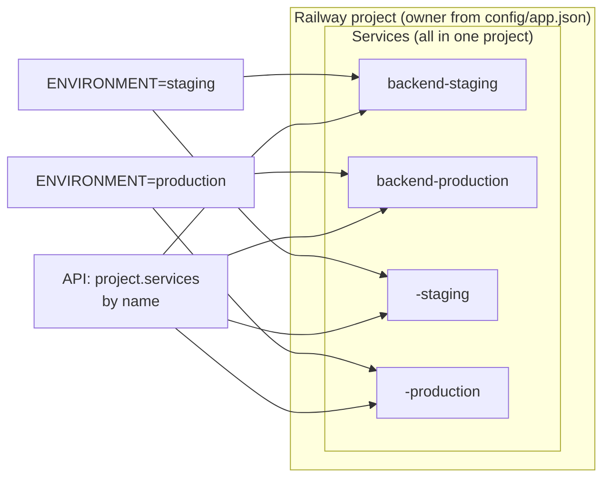
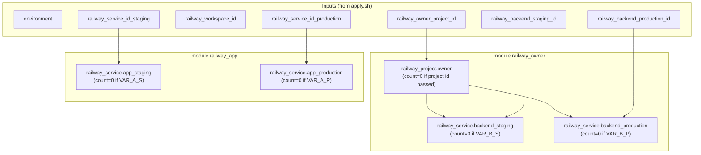
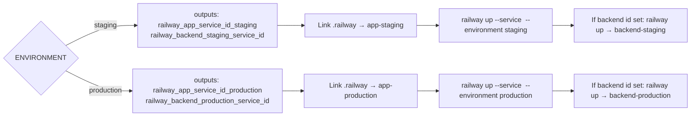
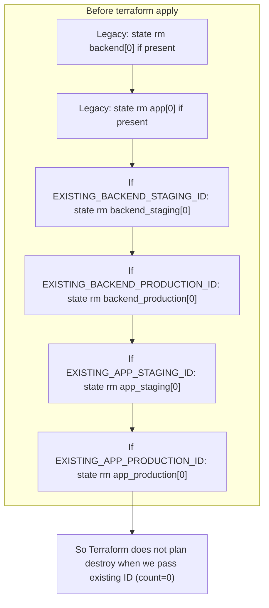
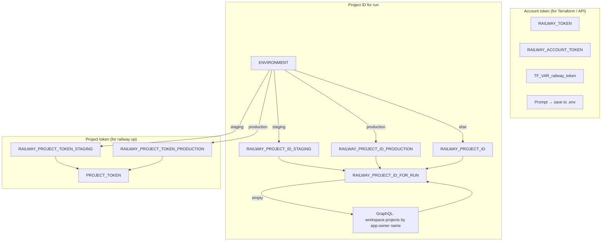

# MTX Terraform Apply – State & Logic Flows

## 1. High-level flow

```mermaid
flowchart TB
    subgraph entry["Entry"]
        A([mtx deploy / terraform apply])
        A --> ARGS["Parse args: ENVIRONMENT (staging|production), --force-backend"]
        ARGS --> ENV_FILE["Load .env if present"]
    end

    subgraph config["Config & Platform"]
        ENV_FILE --> C1{config/deploy.json exists?}
        C1 -->|no| EXIT1([Exit 1])
        C1 -->|yes| C2["Parse platform array"]
        C2 --> HAS_RAILWAY{"platform contains railway?"}
        HAS_RAILWAY -->|no| EXIT2([Exit: Railway required])
        HAS_RAILWAY -->|yes| APP_SLUG["Read app slug from config/app.json"]
    end

    subgraph token["Token resolution"]
        APP_SLUG --> T1{RAILWAY_TOKEN / RAILWAY_ACCOUNT_TOKEN / TF_VAR?}
        T1 -->|yes| T_OK["Use token, add to TF_VARS"]
        T1 -->|no| T_PROMPT["Prompt for token"]
        T_PROMPT --> T_SAVE["Save to .env (set_env_var_in_file)"]
        T_SAVE --> T_OK
    end

    subgraph resolve["Resolve workspace & project"]
        T_OK --> W{RAILWAY_WORKSPACE_ID set?}
        W -->|no| W_API["GraphQL: me.workspaces by app.owner"]
        W -->|yes| W_OK["Add to TF_VARS"]
        W_API --> W_FAIL{Found?}
        W_FAIL -->|no| EXIT3([Exit: workspace required])
        W_FAIL -->|yes| W_OK
        W_OK --> P{RAILWAY_PROJECT_ID_FOR_RUN?}
        P -->|env: RAILWAY_PROJECT_ID_STAGING/PRODUCTION| P_SET["Use env-specific project ID"]
        P -->|else| P_API["GraphQL: workspace.projects by owner name"]
        P_API --> P_SET
        P_SET --> TF_VARS_PROJECT["TF_VARS += railway_owner_project_id"]
    end

    subgraph discover["Service discovery"]
        TF_VARS_PROJECT --> S_QUERY["GraphQL: project.services (edges/node)"]
        S_QUERY --> DISCOVER["discover_railway_services(): get_id for each"]
        DISCOVER --> FOUR["EXISTING_BACKEND_STAGING_ID, EXISTING_BACKEND_PRODUCTION_ID,\nEXISTING_APP_STAGING_ID, EXISTING_APP_PRODUCTION_ID"]
        FOUR --> INVALIDATE{".railway-backend-invalidated exists?"}
        INVALIDATE -->|yes| CLEAR_B["Clear both backend existing IDs"]
        INVALIDATE -->|no| ADD_VARS["For each existing ID: TF_VARS += railway_*_id"]
        CLEAR_B --> ADD_VARS
    end

    subgraph tf["Terraform"]
        ADD_VARS --> TF_INIT["terraform init -reconfigure"]
        TF_INIT --> LEGACY["Remove legacy state: backend[0], app[0] if present"]
        LEGACY --> STATE_RM["For each existing *: state rm that resource (avoid destroy)"]
        STATE_RM --> TF_APPLY["terraform apply -auto-approve TF_VARS"]
        TF_APPLY --> TF_OK{Exit 0?}
        TF_OK -->|no| ALREADY{"Log: already exists?"}
        ALREADY -->|yes| REDISCOVER["Rediscover services, add IDs, state rm, apply again"]
        REDISCOVER --> TF_OK
        ALREADY -->|no| INIT_RETRY{"Log: init required?"}
        INIT_RETRY -->|yes| TF_INIT
        INIT_RETRY -->|no| EXIT4([Exit 1])
        TF_OK -->|yes| SUCCESS
    end

    subgraph deploy["Deploy code (HAS_RAILWAY)"]
        SUCCESS["Apply success"] --> OUT["Read outputs by ENVIRONMENT"]
        OUT --> OUT_STAGING["staging: railway_app_service_id_staging, railway_backend_staging_service_id"]
        OUT --> OUT_PROD["production: railway_app_service_id_production, railway_backend_production_service_id"]
        OUT_STAGING --> DEFER
        OUT_PROD --> DEFER
        DEFER["Fallback: use EXISTING_*_ID if output empty"]
        DEFER --> TARGET["Print deploy target: app, backend, env"]
        TARGET --> NO_APP{SERVICE_ID empty?}
        NO_APP -->|yes| SKIP(["Skip deployment"])
        NO_APP -->|no| LINK["Link .railway to app service (this env)"]
        LINK --> BUILD["npm install? build:server"]
        BUILD --> ENV_SETUP["Resolve project token (staging/production), ensure env exists"]
        ENV_SETUP --> APP_UP["deploy_to_railway(project, SERVICE_ID, ENVIRONMENT)"]
        APP_UP --> TOKEN_RETRY{Token error?}
        TOKEN_RETRY -->|yes| PROMPT_TOKEN["Prompt new token, save .env, retry"]
        TOKEN_RETRY -->|no| APP_DONE["App deploy done"]
        PROMPT_TOKEN --> APP_UP
        APP_DONE --> DOMAIN_APP["railway domain (app)"]
        DOMAIN_APP --> BACKEND_BLOCK{BACKEND_SERVICE_ID set?}
        BACKEND_BLOCK -->|no| DONE
        BACKEND_BLOCK -->|yes| SWAP_RAILWAY_JSON["Swap railway.json to backend-server config"]
        SWAP_RAILWAY_JSON --> BUILD_BACKEND["build:backend-server"]
        BUILD_BACKEND --> LINK_BACKEND["railway link --service BACKEND_DEPLOY_ID"]
        LINK_BACKEND --> BACKEND_UP["deploy_to_railway(backend, ENVIRONMENT)"]
        BACKEND_UP --> BACKEND_OK{Success?}
        BACKEND_OK -->|yes| RM_INVALID["rm .railway-backend-invalidated"]
        BACKEND_OK -->|no| BACKEND_404{404 / upload failed?}
        BACKEND_404 -->|yes| SELF_HEAL["state rm backend_${ENVIRONMENT}[0], touch invalidated, re-run apply"]
        BACKEND_404 -->|no| RESTORE_LINK
        RM_INVALID --> RESTORE_LINK["Restore .railway to app service"]
        SELF_HEAL --> RESTORE_LINK
        RESTORE_LINK --> RESTORE_JSON["restore railway.json"]
        RESTORE_JSON --> DONE(["Deployment complete"])
    end
```

## 2. Railway state (four services, one project)

## 3. Terraform module state (create vs use existing)

## 4. Deploy target selection (by ENVIRONMENT)

## 5. State removal logic (avoid destroying existing services)

## 6. Token and project resolution

